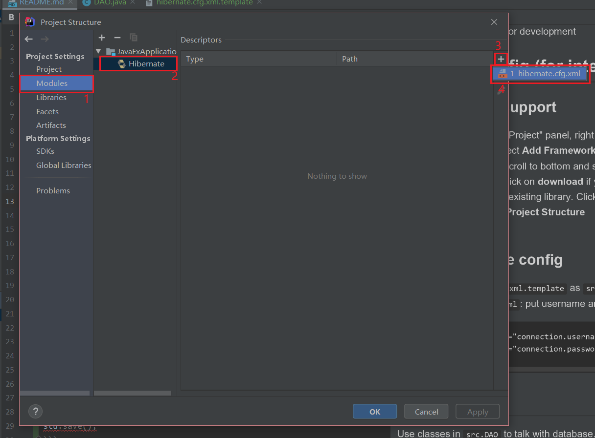
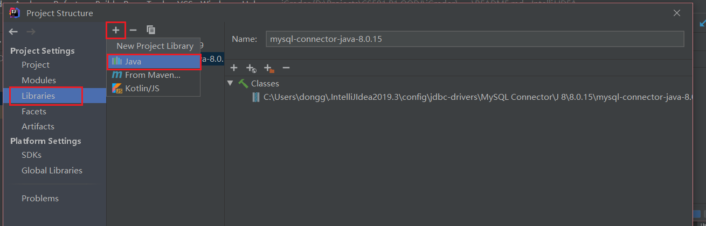

# iGrader

**This is NOT the final doc**

Put here anything useful for development

## MySQL environment
1. Download and install MySQL: [click here](https://dev.mysql.com/downloads/installer/)
2. Start MySQL (May need to config global variable)
3. Create a table in database:
```mysql
CREATE DATABASE igrader;
USE TABLE igrader;
```
4. Init the database with our scheme: Run code in [PonyORM](https://editor.ponyorm.com/user/donggu/Grading_Sys/mysql)

## Database IDE config (for intelliJ IDEA)
### Update database config
1. Copy `src/hibernate.cfg.xml.template` to `src/hibernate.cfg.xml`
2. Edit `src/hibernate.cfg.xml`: put username and password
```xml
        <property name="connection.username">YOUR USERNAME</property>
        <property name="connection.password">YOUR PASSWORD</property>
```
### Add Hibernate support
1. On IDEA's left hand "Project" panel, right click on project folder (`iGrader`), select **Add Framework Support...**
2. In the popup menu, scroll to bottom and select **Hibernate**
3. On right hand side, click on **download** if you don't have one. Otherwise select the existing library. Click **OK**.
4. In menu bar, **Files - Project Structure**
5. Do as follows to add the config file. Click **OK**.


### Add MySQL connector (JDBC)
1. Download jdbc library with [this link](https://dev.mysql.com/get/Downloads/Connector-J/mysql-connector-java-8.0.18.zip). Unzip to get the `.jar` file.
2. In IDEA, **Files - Project Structure**
3. In **Library** tab:

4. Browse and select the `.jar` file you just downloaded
5. Click **OK** to save the setting.

### Test
Run `src/Test/DatabaseTest::Main`, if no error, then you're good to go!

## Model usage
Use classes in `src.Database` to talk with database. Database means Data Access Object.

### Create
```java
Student stu = new Student("U1234567", new Name("Alice"), false);
stu.save();
```

### Read
```javaFind
Database dao = new Database();
Student stu = Database().findById(Student.class, "U123456789");
```

### Update (update database)
```java
stu.setGrad(false);
stu.update();       // Database will be updated
```

### Refresh (update object)
```java
stu.getName().getFirstName();       // "Alice"
stu.getName().setFirstName("Bob");
stu.refresh();                      // Object will be updated by database
stu.getName().getFirstName();       // "Alice"
```

### Delete
```java
new Database().delete(Student.class, stu.getId());
```

### Query
```java
List result = new Database().query("some hql query");
```