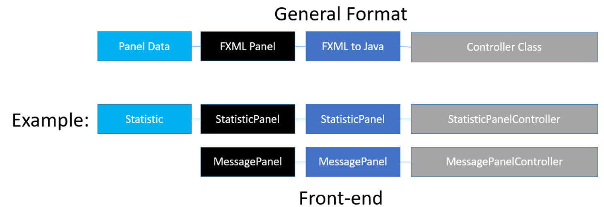

# iGrader
> Dongyi He, dongyihe@bu.edu  
> Alexandr Kim, aik2347@bu.edu  
> Xiao Lu, lux@bu.edu  
> Vidya Akavoor, vidyaap@bu.edu

## Overview
In this document, we will outline our design for the iGrader student grading system. We will provide an overview of the goals and objectives of the program, go through the implemented object structure, and discuss the merits of the overall design.

## Scope
Our grading system aims to make it easier for Professor Papadakis-Kanaris to enter grades for her multiple classes and compute each student’s final grade. The drawbacks of the current system that we tried to address are the: 
- Inability to maintain a template version of a class that is reusable 
- Inconvenience of keeping comments on students, grades, or assignments 
- Difficulty of calculating statistics across different subsets of students 

## Functionality
The overall program is designed to keep a lot of the excel functionality but make the necessary changes to address the drawbacks of keeping separate excel files for each class. We expect our program to maintain and display grades for each student in each of the professor’s classes. 

After logging in, the professor should be able to select a class and view the breakdown of grades on the highest level. This view should be akin to a collapsable version of excel where the main table will only show the largest sub-sections of the grade like “Homework” or “Exams.” Upon clicking those, additional details will be displayed based on whether the clicked category can be broken down further. This means that items can be constantly broken down, from the Homework category to a specific assignment to parts of an assignment as necessary. The program will display what grade each student got on those sub-parts of the category and any comments for that category. 

Each cell is also clickable and editable. The tabular form allows for easy switches between multiple class sections. Hovering over a cell reveals any comments made about a particular item.

The main landing page will also have additional buttons to:
- Create and remove additional classes or sections
- Edit the grading scheme to add or remove elements
- Add, remove and freeze students
- See overall class statistics

## Goals
Aside from our general functionality goals as outlined above, we also had some goals for timeline and scheduling. We had originally planned to finish implementing our functionality by the 10th to keep with the original deadline. However, due to challenges in scheduling and learning javafx, this did not go as smoothly as anticipated. While we did not miss our deadline by a large margin, finishing earlier would have given us a little more time to polish the details of the project.

Some of the challenges we faced had to do with simply scheduling time to meet. As we had varying schedules from full-time jobs to having to drive in to the city to meet, finding overlapping free time was sometimes a challenge. Another set of challenges came from having never used javafx before. The learning curve was a little larger than we thought it would be, but we managed to find resources and learn in time to complete our project.

## Model Design
### Overview
We have a really clean and clear class design.

### How we implement grading scheme
- Each grading item/column is a `Subject`. For example, "Homework" and "Exam" can be two different `Subject`.
- Each `Subject` can be composed of multiple children `Subject`s, as "Homework" can be broke down to "HW 1" and "HW2", then be graded independently.

All `Subject` and its children of a course eventually become a typical **tree** structure:

In this way, each `Course` just need to hold a root `Subject` for its the scheme.

#### Flexibility & Cleanliness
- Label of `Subject` can be set to anything! No longer restricted by any hardcoded category settings!
- We allow **infinite** depth of the tree! Users can break down as detailed as they want!
- Only **one** class is used for the scheme. All methods, specifically the grade-computation-related logic, can be implemented once and called recursively, making it easy to debug and prevent duplicated codes

### Where are the Grades?
- Each `Grade` holds its `Subject`, `Student` and the `Score`.
- A class `Score` is made to embed actual points and bonus
- Each subject will hold a map from `Student` to `Grade`; Score output can also come from the weighted average of its children

### Course, Section and Student
#### Course
`Course` holds a list of `Section`s, and a root `Subject` for its scheme reference

#### Section
`Section` holds a list of `Student`s, with a label specifying its name. There is a `curve` field marking the curve value for this section.

#### Student
Each `Student` has an ID, a name and a graduation type. A boolean property `frozen` will be set true if the student withdraw the class.

### Commentable
`Subject`, `Student` and `Grade` implemented `Commentable` interface to provide extra comment.

### Dive into Database... 
The project used [Hibernate](https://hibernate.org/) to MySQL database connection and object-relational mapping. Other than intuitive entity annotation within `Model` package, we implemented a `DAO` class and `BaseEntity` class to encapsulate all DB-related "dirty job".

#### Data Access Object (DAO)
The class integrated all direct database access, including session operations and some basic query functionality. Any database access in the project will calling the methods provided in the class.

#### BasicEntity
The abstract class provide `save`, `update` and `refresh` methods to directly update a record in the database. With most of the classes in `Model` implemented this, it provides convenience when our teammate want some simple database CRUD.

## Front-end implementation

We have a lot of different panels but the structure of them all follow a similar format. There are three main panel elements and a fourth data structure if needed. The black FXML panel sets the overall UI panel outline. The FXML to Java file allows Java to read in the FXML file. The controller class contains all the functions and methods associated with a panel. The data structure helps store table data in a more convenient format to allow an easier bind to a table.

## Database design

